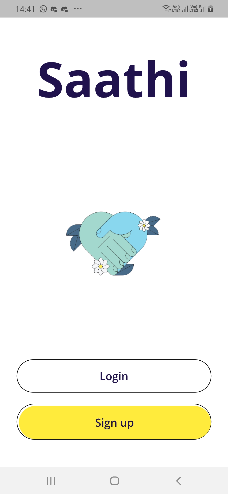
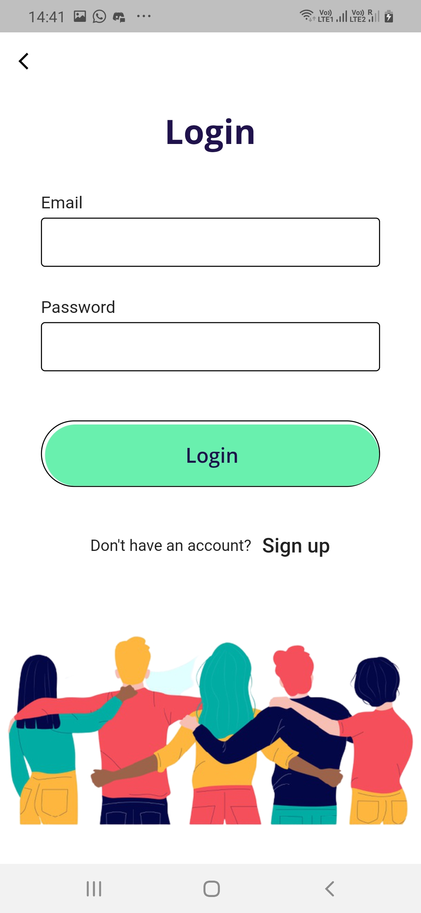
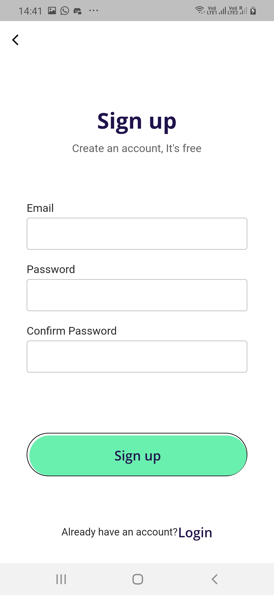
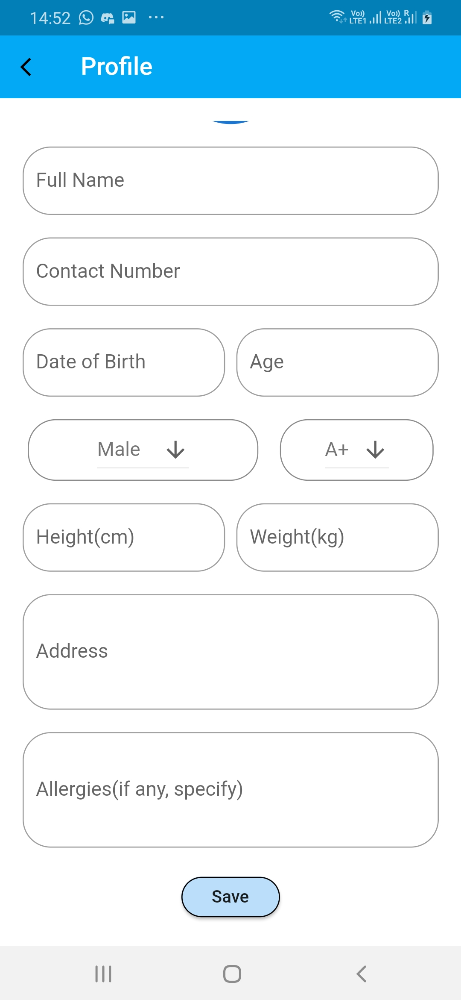
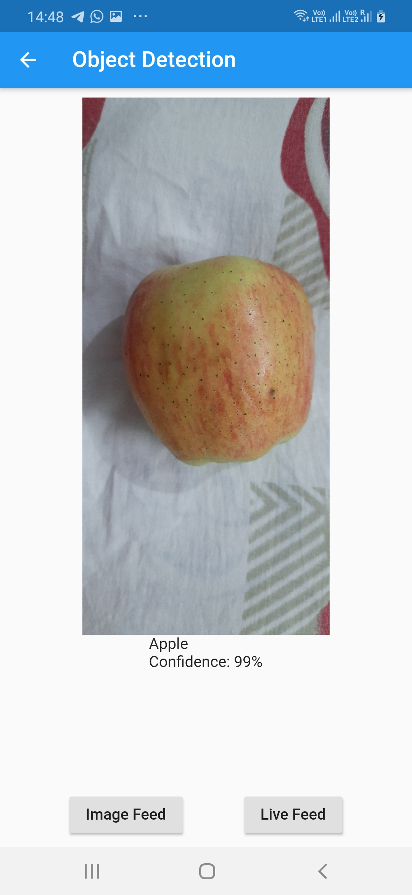

# Introduction

There are almost **285 million** people across the globe, who are suffering from the problem of Vision Impairment, out of which, **13% people** have *no vision*. 

A lot of problems faced by them on a regular basis can be resolved by using Technology. But even after so many attempts, Technology is not as accessible to them as it should be and there are very less solutions created by keeping them in mind. 

So, in order to ease their day-to-day struggles, we are trying to make optimized solutions to make Technology more accessible to them.

## Problem Statement

Its a tedious task for people with Visual Impairment to decide what to eat, **especially if they are alone and the food item is packaged.**
A lot of factors such as **Allergic items, Preservatives, Expiry date** which can complicate this even further. With no such way for them to determine this alone, it can sometimes pose as a serious problem, if something unsuitable is consumed.

**The biggest challenge is to determine whether it is suitable for them to consume it or not.**

## Limitations of Existing Solutions :

+ Not compatible with Talkback

+ Lack of user-friendly UI

+ No personalized results

## That's the reason SAATHI is here :

In this interactive app, we have taken great care of the problem faced by Visually Impaired people and addressed all the issues related to them. 

We have integrated the entire platform with **Voice Technology**, so that storing information won't be a problem for them.

# Screenshots
<pre>
    

</pre>
## And how it works ?

Besides storing some basic profile information, it would ask the user about their food preferences, any health issues and if they are allergic to a particular substance.

Then it would scan the nearby areas for edible items, fruits, vegetables and cereals including packaged food-items. 

It would give the output by converting the result to speech through TTS(Text-To-Speech) to the user. 
In case, the item is packaged, it would scan the packet and check for :

+ **The type of food (Veg, Non veg, Vegan, Glutten free etc.)**

+ **Nutrition Chart( % of Sugar, Cholestrol, Fat, Sodium, Preservatives etc. )**

+ **Ingredients ( Main component, Secondary component etc.)**

+ **Some other Relevant information ( Expiry date, Preparation guide etc. )**

<h4>On the basis of these three, it would check for any item that can be unsuitable for the user, and would alert the user by giving a warning about the same.</h4>

In this way, it can assist them in finding the suitable food items whenever they need by giving accurate and personalised results.

## Extensions in Future

+  For elderly people with poor eyesight

+  For Illiterate people with Local language support

## About us :

<h4> Created with ❤️ by :</h4>

Ankita Saloni    -   [saloniankita](https://www.linkedin.com/in/saloniankita/)

Akanksha Singh   -  [akanksha1212](https://www.linkedin.com/in/akanksha1212/)

Sayali Ingle     -   [sayali-ingle](https://www.linkedin.com/in/sayali-ingle-3194251b8/)

Shivani Susarla  -   [shivani-susarla](https://www.linkedin.com/in/shivani-susarla-240744186/)

